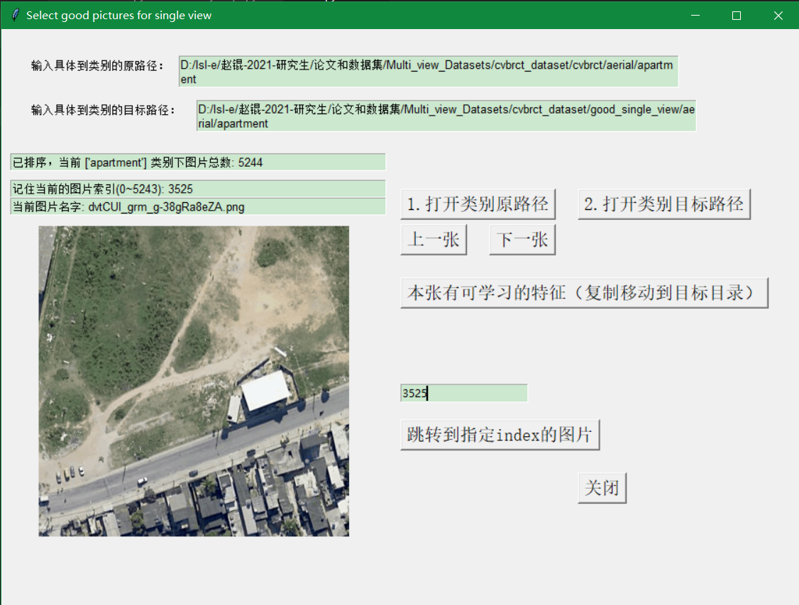

# 1.Select-good-pic-by-single-view
## 功能描述
用python自带tkinter完成的gui功能：在单视角数据集挑选有可学习特征的图片，复制到输出目录。（注意这里是1个视角，对应输出到1个目录）
有详细的代码和文件，并且有打包为exe功能，可以直接在别人电脑运行，有打包的说明。

### Select-good-pic-by-single-view的流程说明：
1.点击按钮1，打开要挑选的单视角下的某个类别的目录
比如：D:/lsl-e/赵锟-2021-研究生/论文和数据集/Multi_view_Datasets/cvbrct_dataset/cvbrct/aerial/apartment

2.点击按钮2，找到要输出的目标类别目录，需要提前手动建立好这个类别目录，跟原来的目录结构保持一致。
比如：D:/lsl-e/赵锟-2021-研究生/论文和数据集/Multi_view_Datasets/cvbrct_dataset/good_single_view/aerial/apartment

3.点击上一张或下一张 查看并选择图片。

4.如果觉得有特征就点击 本张有可学习特征的按钮，会自动复制输出到目标目录。

5.记住当前的类别和index，以防下次时忘记挑选到哪了，下次直接输入index，点击 跳转按钮，
可以直接选择到index对应的图片。
### 演示图片：

# 2.Select-goodmatch-pic-by-good-twoviews
## 功能描述
用python自带tkinter完成的gui功能：在挑选出的双视角数据集挑选同时存在且完美匹配的图片，复制到输出目录。（注意这里应该是2个视角，对应输出到2个目录）
有详细的代码和文件，并且有打包为exe功能，可以直接在别人电脑运行，有打包的说明。

### Select-goodmatch-pic-by-good-twoviews的流程说明：
1.

2.

3.

4.

